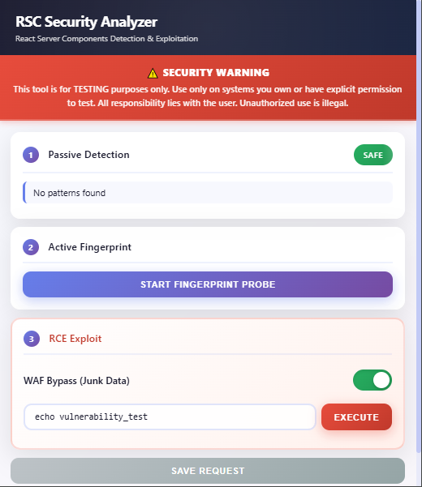

<div align="center">


# RSC Security Analyzer


**A powerful Chrome extension for detecting and analyzing React Server Components (RSC) and Next.js App Router vulnerabilities**

[Features](#-features) • [Installation](#-installation) • [Usage](#-usage) • [Screenshots](#-screenshots) • [Disclaimer](#-disclaimer)

</div>

---

## 📋 Table of Contents

- [Overview](#-overview)
- [Features](#-features)
- [Installation](#-installation)
- [Usage](#-usage)
- [Technical Details](#-technical-details)
- [Screenshots](#-screenshots)
- [Disclaimer](#-disclaimer)
- [License](#-license)

## 🎯 Overview

RSC Security Analyzer is a specialized Chrome extension designed for security researchers and penetration testers to identify and analyze React Server Components (RSC) implementations, particularly in Next.js applications. The extension provides both passive detection and active fingerprinting capabilities, along with advanced exploitation features.

### What is RSC?

React Server Components (RSC) is a React feature that allows components to run on the server, enabling more efficient data fetching and rendering. Next.js App Router uses RSC extensively, which can introduce security vulnerabilities if not properly configured.

## ✨ Features

### **Passive Detection**
- Automatically scans pages for RSC indicators
- Detects `Content-Type: text/x-component` headers
- Identifies `window.__next_f` (Next.js App Router)
- Searches for `react-server-dom-webpack` references
- Real-time badge notifications when RSC is detected

### **Active Fingerprinting**
- Sends RSC-specific headers to probe server responses
- Analyzes response headers (`Content-Type`, `Vary`)
- Validates React Flight Protocol structure
- Provides detailed detection results

### **RCE Exploitation**
- Advanced command execution capabilities
- WAF bypass with configurable junk data injection
- Automatic request/response analysis
- Export request data for further analysis
- Server response status and title extraction

### **WAF Bypass**
- Optional junk data injection (128KB)
- Configurable bypass parameters
- State persistence across sessions

## 📦 Installation

> **⚠️ Important:** This extension is not published on the Chrome Web Store. You need to load it as an unpacked extension in Developer Mode.

### Prerequisites

1. **Install Google Chrome**
   - Download from [Google Chrome](https://www.google.com/chrome/)
   - Ensure you have Chrome version 142.0.7444.176 or higher
   - Install and launch Chrome

### Method 1: Manual Installation (Recommended)

1. **Download the Extension**
   ```bash
   git clone https://github.com/quxaa/RSC_Detector-Chrome.git
   cd RSC_Detector-Chrome
   ```

2. **Load in Chrome**
   - Open Chrome and navigate to `chrome://extensions/`
   - Enable "Developer mode" toggle in the top-right corner
   - Click "Load unpacked" button
   - Select the extension directory (the folder containing `manifest.json`)
   - The extension will be loaded and ready to use

3. **Verify Installation**
   - Look for the RSC Detector icon in your Chrome toolbar
   - The extension is now ready to use!

### Method 2: From ZIP

1. Download the latest release ZIP file
2. Extract the contents to a folder
3. Follow steps 2-3 from Method 1

## 🚀 Usage

### Basic Workflow

1. **Navigate to Target Site**
   - Open the website you want to analyze in Chrome
   - The extension automatically performs passive detection

2. **View Passive Detection Results**
   - Click the extension icon in the toolbar
   - Review the "Passive Detection" section for automatic findings
   - Status indicators:
     - 🔴 **DETECTED**: RSC patterns found
     - 🟢 **SAFE**: No RSC indicators detected
     - ⚪ **SCANNING**: Analysis in progress

3. **Perform Active Fingerprinting**
   - Click "Start Fingerprint Probe" button
   - Review the results in the "Active Fingerprint" section
   - Check for RSC-specific response patterns

4. **Exploitation (Advanced)**
   - ⚠️ **Use responsibly and only on systems you own or have explicit permission to test**
   - Enter a command in the input field (default: `echo vulnerability_test`)
   - Optionally enable WAF Bypass
   - Click "Execute" to run the exploit
   - Review the output in the console
   - Use "Save Request" to export the request for further analysis

### Advanced Features

#### WAF Bypass
- Toggle the "WAF Bypass (Junk Data)" switch to enable
- Adds 128KB of random data to the request payload
- Useful for bypassing Web Application Firewalls
- State is saved in localStorage

#### Request Export
- After executing an exploit, click "Save Request"
- Request is saved as `request_<domain>.txt`
- Contains full HTTP request including headers and body
- Useful for manual testing or reporting

## 🔧 Technical Details

### Detection Methods

#### Passive Detection
- **Content-Type Check**: Looks for `text/x-component` MIME type
- **Next.js Detection**: Searches for `window.__next_f` global variable
- **Library Detection**: Scans for `react-server-dom-webpack` references

#### Active Fingerprinting
- Sends `RSC: 1` header in GET request
- Analyzes response for:
  - `Content-Type: text/x-component`
  - `Vary: RSC` header
  - React Flight Protocol format (`^\d+:["IHL]`)

### Exploitation Technique

The extension uses a sophisticated payload structure targeting RSC deserialization vulnerabilities:

- **Payload Structure**: Multipart form data with React Flight Protocol
- **Command Injection**: Uses `child_process.execSync()` for command execution
- **Response Parsing**: Extracts base64-encoded command output from error digest
- **WAF Bypass**: Optional junk data injection to evade detection

### Browser Compatibility

- **Chrome**: 142.0.7444.176 or higher
- **Manifest Version**: 3

## 📸 Screenshots


### Main Interface




## ⚠️ Disclaimer

**This tool is for educational and authorized security testing purposes only.**

- Only use on systems you own or have explicit written permission to test
- Unauthorized access to computer systems is illegal
- The authors are not responsible for misuse of this tool
- Use responsibly and ethically

**By using this extension, you agree to:**
- Use it only for legitimate security research
- Obtain proper authorization before testing
- Comply with all applicable laws and regulations
- Not use it for malicious purposes

## 📄 License

This project is licensed under the MIT License - see the [LICENSE](LICENSE) file for details.

---

<div align="center">

**⭐ If you find this project useful, please consider giving it a star! ⭐**

Made with ❤️ for the security research community

</div>

